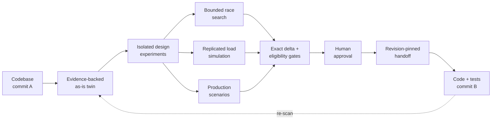

<div align="center">


# System Design Studio

**Draw a system. Watch it break. Fix it. Hand it to your agent.**

An evidence-backed architecture workbench for finding races, measuring systems under load,
comparing real trade-offs, and turning an approved design into an implementation-ready handoff.

[](https://www.typescriptlang.org/)
[](https://react.dev/)
[](https://vite.dev/)
[](https://pnpm.io/)
[](LICENSE)


[Quick start](#quick-start) · [How it works](#how-it-works) · [Capabilities](#capabilities) · [Architecture](#architecture) · [Documentation](#documentation) · [License](#license)

</div>

---

System Design Studio turns an existing codebase into an executable architecture twin. Every
observed component and connection can be traced back to source evidence; every unknown stays
visible as an inference or assumption. From there, the Studio searches bounded execution orders,
runs replicated load simulations, exercises production scenarios, and compares only the designs
that passed their stated gates.

It is built around one practical loop:



## Capabilities

| Reconstruct | Break | Measure |
| --- | --- | --- |
| Import a repository revision as an immutable as-is baseline, with evidence on every modeled claim. | Find a shortest bounded execution that violates an invariant, then replay it on the canvas. | Simulate latency, throughput, utilization, queues, retries, failures, and business outcomes across independent seeds. |
| **Explore** | **Compare** | **Hand off** |
| Search topology, trace authored upstream/downstream reach, and inspect source-grounded components and links. | Apply correctness and calibration gates, show the exact authored delta, and expose Pareto trade-offs without inventing a score. | Pin approval to exact baseline and experiment revisions, then produce acceptance criteria and source hints for a coding agent. |

The current modeling vocabulary includes clients, real-time gateways, load balancers, application
services, third-party APIs, caches, relational databases, object stores, queues, and lease services.
It can surface problems such as lost updates, double bookings, stale or unfenced leases, idempotency
mistakes, queue redelivery, retry storms, growing backlogs, and capacity bottlenecks.

## Quick start

You will need Node.js 22+ and pnpm 11.

```bash
git clone https://github.com/WebSims/system-design-studio.git
cd system-design-studio
pnpm install
pnpm dev
```

Open [http://localhost:5173](http://localhost:5173), then choose a starting point:

1. **Worked scenario** — open *two hundred free pizzas* and press **Find races** to see a minimal counterexample immediately.
2. **New project** — start with a genuinely blank canvas and model a system by hand.
3. **From a codebase** — copy the supplied prompt into a WebMCP-capable coding agent and watch it reconstruct the repository as it reads the source.

The app stores projects locally in the browser. Projects can also be imported and exported as JSON.

## How it works

### 1. Draw the system that exists

Model runtime and capacity boundaries—not merely folders or classes. A codebase-backed baseline
records its repository revision and classifies evidence as:

- **Observed** — supported directly by code, configuration, runtime data, or the user.
- **Inferred** — a deduction whose reasoning remains explicit.
- **Assumed** — a required model input that has not been measured yet.

Source evidence can include a repository-relative path, symbol, line range, and content hash.
Architecture evidence does not silently double as performance calibration.

### 2. Give requests real steps

Attach workflows to the design: reads and writes are separate scheduling points, while operations
such as atomic updates, unique inserts, and lease acquisition remain indivisible. Define safety
invariants for conditions that must always hold and postconditions for promises that must hold once
execution settles.

### 3. Find how it breaks

The bounded explorer walks reachable states breadth-first and checks the authored contract after
each transition. When a rule fails, the Studio returns a counterexample that is minimal in
transition count and plays the actors, operations, and state changes on the architecture canvas.

Faults are explicit and independently switchable: duplicate submission, same-key retry, fresh-key
retry, worker crash, queue redelivery, lease expiry, and reservation expiry.

### 4. Measure the fix

The discrete-event engine measures steady, ramp, spike, and stepped workloads. It reports latency
intervals, throughput, queue growth, utilization, retry amplification, failure behavior, and domain
outcomes. A standard production suite probes concurrency, a 3× traffic spike, the SLO capacity
boundary, and dependency degradation.

### 5. Compare, approve, and implement

Candidates must clear schema, correctness, issue, calibration, SLO, and business-goal gates before
they are eligible for comparison. Eligible designs are shown as a Pareto frontier—not collapsed into
an arbitrary score. Only a person can approve a revision. The resulting handoff names the exact
before/after values, affected evidence, acceptance criteria, unresolved findings, and pinned source
state.

## Three product views

| View | Question | What you get |
| --- | --- | --- |
| **Behaviour** | Can an allowed order of events break a rule? | Bounded verdict, minimal trace, state timeline, and animated replay. |
| **Load** | Does the design hold up under realistic demand and failure? | Replicated measurements, bottlenecks, production probes, and business outcomes. |
| **Review & hand off** | Which tested versions remain defensible, and what exactly changes? | Gate reasons, exact deltas, Pareto trade-offs, human approval, and an implementation receipt. |

## An intentionally strict truth boundary

| The Studio says | It never turns that into |
| --- | --- |
| **Invariant violated**, with the shortest trace found | A claim about production beyond the model and authored contract |
| **No violation found within these explicit bounds** | “Proved safe” or “verified” |
| **Pareto-optimal among the candidates tested** | “Globally best” or “recommended” |

A search that exhausts its state or time budget reports `INCONCLUSIVE_BOUND_REACHED`, never good
news. Unknown resource values remain unknown rather than becoming zero. Differences smaller than
the measured intervals are ties rather than wins.

## Agent boundary

The Studio exposes 26 top-level [WebMCP](https://learn.chatgpt.com/docs/webmcp) tools for repository
import, incremental drawing, evidence, issue tracking, experiments, evaluation, comparison, canvas
attention, and handoff. The tools coordinate the visual model; the coding agent's normal sandbox and
approval rules still govern repository changes.

### WebMCP implementation

The browser registers every tool against the top-level `document.modelContext`. The production
adapter is in [`apps/studio/src/webmcp/register.ts`](apps/studio/src/webmcp/register.ts), while the
tool definitions and schemas live in [`apps/studio/src/webmcp/tools.ts`](apps/studio/src/webmcp/tools.ts).
Its core registration shape is:

```ts
document.modelContext.registerTool({
  name: tool.name,
  description: tool.description,
  inputSchema: tool.inputSchema,
  annotations: tool.annotations,
  execute: async (input, context) =>
    tool.execute(input, {
      ...(context?.signal ? { signal: context.signal } : {}),
    }),
});
```

The real implementation feature-detects the API, registers the complete `studio_*` catalog in a
loop, forwards cancellation signals, and rolls back partial registration failures.

An agent can create and evaluate isolated experiments. It cannot approve a version, delete a project
or version, mutate an approved design, deploy code, or mark the architecture synchronized. Those
authority-bearing actions stay outside the tool surface.

## Architecture

This is a pnpm workspace with one transition kernel shared by the correctness and performance
engines.

```text
apps/studio         React + React Flow workbench; engine work runs off the UI thread

packages/schema     versioned designs, workflows, evidence, studies, and validation
packages/kernel     the single implementation of executable state transitions
packages/explore    bounded state exploration and counterexamples
packages/core       deterministic discrete-event simulation
packages/analytic   independent closed-form queueing checks
packages/analyze    knees, sensitivity, critical paths, and configuration search
packages/study      scenario evaluation, gates, resources, and Pareto comparison
packages/models     component presets and internal development fixtures
```

The browser app does not receive unrestricted filesystem or deployment access. Simulations run in a
Web Worker, projects live in IndexedDB, and agent mutations pass through the same validation and
revision checks as human edits.

## Development

```bash
pnpm dev             # start the Studio at localhost:5173
pnpm verify          # typecheck + full test suite
pnpm build           # production build
pnpm sim --validate  # compare simulation output with queueing theory
pnpm sim --sweep     # find the load knee across a rate sweep
```

The real-browser acceptance suite expects a built app and preview server:

```bash
pnpm build
pnpm --filter @sds/studio preview --port 4319

# In another terminal
pnpm browser
```

## Documentation

| Guide | Covers |
| --- | --- |
| [MVP workflow](docs/usage.md) | Codebase reconstruction, manual modeling, worked scenarios, and the end-to-end agent loop. |
| [Correctness](docs/correctness.md) | Search semantics, explicit bounds, counterexamples, and safety vs. postconditions. |
| [Engine](docs/engine.md) | Components, uncertainty, failures, workload models, and the analyzer. |
| [One kernel, two engines](docs/kernel.md) | Why exploration and simulation share one executable implementation. |
| [Comparison](docs/portfolio.md) | Eligibility gates, resource accounting, intervals, and the Pareto frontier. |
| [Agent surface](docs/agent.md) | WebMCP tools, trust boundaries, revision checks, approval, and implementation handoff. |
| [Testing](docs/testing.md) | Theory-backed validation, browser acceptance, and useful CLI checks. |
| [Design rules](docs/design-rules.md) | Product principles, claim boundaries, and deliberate non-goals. |
| [Product plan](docs/plan.md) | What is complete, what comes next, and the end-to-end acceptance test. |
| [Worked example](docs/examples.md) | Seven pizza-allocation designs, including four intentionally broken ones. |
| [Archify review](docs/archify-review.md) | Ideas adopted, adapted, and deliberately left out. |

## License

System Design Studio is open source under the [MIT License](LICENSE).

---

<div align="center">

**A model is useful when it can show its evidence, state its limits, and fail loudly.**

</div>
